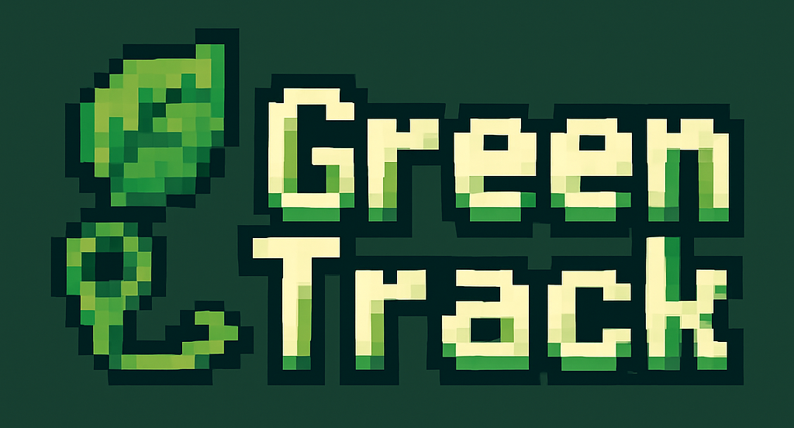
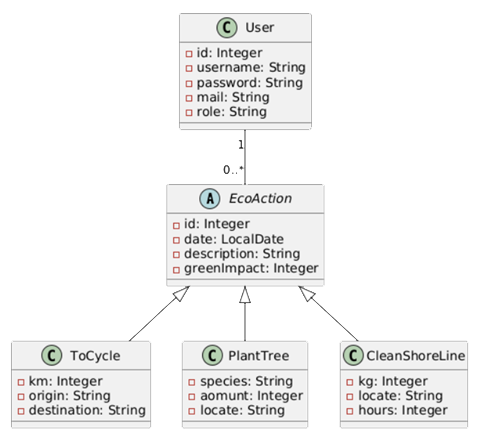
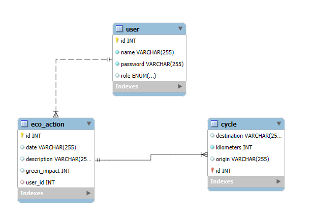
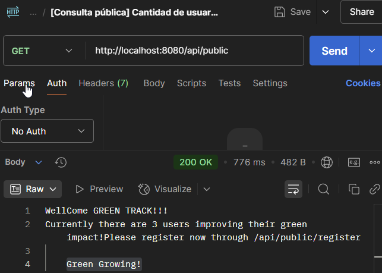
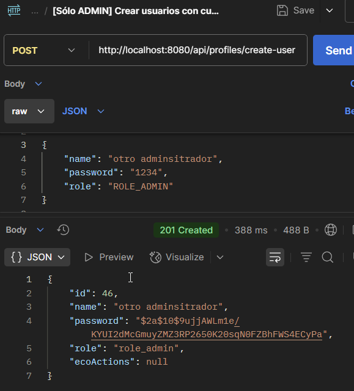
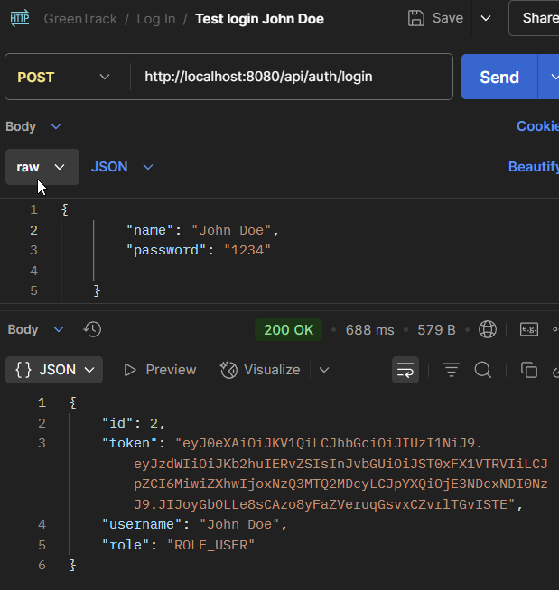
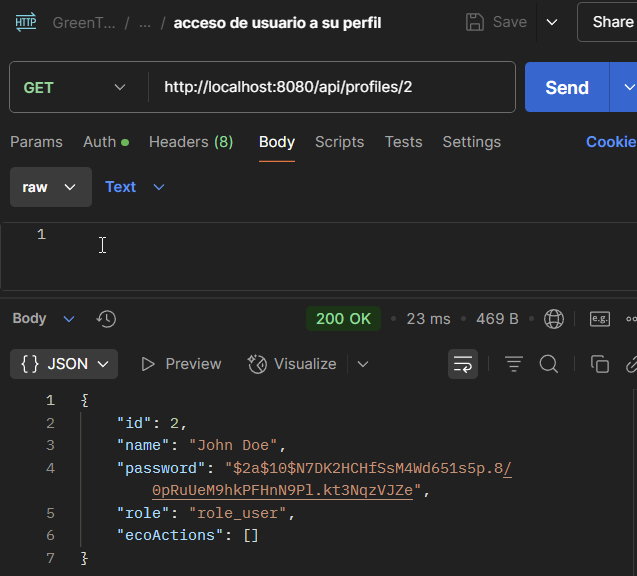
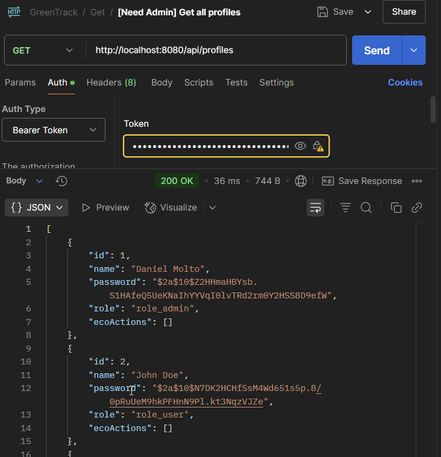
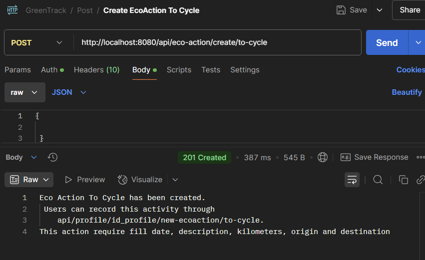
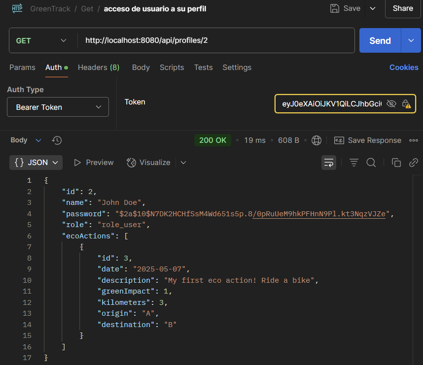

# greenTrack
### Green Track Project

Repositorio
https://github.com/peterParker79/greenTrack

Gestión de tareas con Trello
https://trello.com/b/R9eF2fVX/greentrack

Swagger:
http://localhost:8080/swagger-ui/index.html#

# “GreenTrack” — Hábitos Ecológicos
Aplicación backend  diseñada con Spring Boot, Spring Security y Java 21.
Uso: Registro y seguimiento de hábitos sostenibles con el medio ambiente
enfocado a  personas que desean contabilizar una  huella ecológica positiva
denominada GreenImpact.  
Los Usuarios  registran actividades como ir en bicicleta, reciclar plásticos, 
plantar árboles, limpieza de costa marítima etc.

* Los usuarios se  dan de alta en la aplicación con nombre y contraseña.

* Los usuarios registran sus acciones ecológicas acumulan impacto verde  
basado en una puntuación numérica básica (GreenImpact).

* Los administradores podrán dar de alta  nuevas acciones ecológicas llamadas ecoAcciones.
- - -
## Diseño
Diseño enfocado a la sencillez, funcionabilidad y escalabilidad.

### Diagrama de clases

---

### Schema BBDD

- - -
# Bienvenid@ a GreenTrack
El inicio de la app lo obtenemos en el siguiente endpoint.
http://localhost:8080/api/public

Nos muestra un mensaje de bienvenida y cómo podemos registrarnos.

### Para registrar un usuario: 

Registro de usuario: Es de acceso libre realizar un registro de usuario. 
http://localhost:8080/api/public/register 

En el body de la petición se requiere nombre de *usuario* y *password*: 
{

        "name": "Alicia Gonzalez",
        "password": "1234"                
    }
Se obtiene un mensaje con los detalles del usuario registrado donde aparecen: 

- nombre, 
- contraseña cifrada, 
- rol obtenido,

Ejemplo: 

Los usuarios registrados obtienen un rol de usuario con acciones limitadas.

 

### Para registrar un usuario con privilegios Administrador: 
Sólo un usuario Administrador puede crear usuarios con privilegios Administrador. 

El registro se ha de realizar a través de: 
http://localhost:8080/api/profiles/create-user 
(Ruta accesible sólo con  bearer token  Admin.) 

En el body de esta petición POST introducimos los datos del usuario Administrador a crear. 
{

        "name": "otro administrador",
        "password": "1234",
        "role": "ROLE_ADMIN"
        
    }

Debemos tener la Authorización en Bearer Token y haber proporcionado un token válido

Resultado de crear un nuevo administrador:

### Inicio de sesión y obtención de token: 
Una vez un usuario se ha registrado  puede ingresar en el sistema proporcionando  
el nombre de usuario y la contraseña empleada durante el proceso de registro en la siguiente ruta: 

http://localhost:8080/api/auth/login
 
En el body debemos introducir el usario y contraseña empleados en el registro 
{  
"name": "John Doe", 
"password": "1234" 
} 

Aparece el resultado del proceso de acceso. 
Se visualiza id, token para el usuario, el nombre y el rol.
 

### Acceso al perfil de usuario
Cada usuario con rol de usuario sólo puede acceder a su perfil 
Acceso a perfil de usuario: 
http://localhost:8080/api/profiles/id_usuario   

 
### Mostrar todos los usuarios registrados
Sólo usuarios Administradores. 
Es necesario un bearer token de usuario administrador. 
http://localhost:8080/api/profiles

### Dar de alta acciones eccológicas (nueva ecoAcción)
Sólo los usuarios Administradores pueden crear eco acciones nuevas. 
Los usuarios registrados podrán indicar que han realizado alguna de las eco acciones 
disponibles.

A través del siguiente endPoint un administrador registra una nueva ecoAcción 
Ejemplo: montar en bicicleta(to-cycle). 
Una vez crearda, se muestran los detalles requeridos para que un usuario indique  
que ha realizazo este tipo de ecoAcción.  
http://localhost:8080/api/eco-action/create/to-cycle

        
### Usuario del sistema registrando acciones ecológicas
Los usuarios del sistema pueden ir registrando sus eco acciones y acumulando puntos. 
Ejemplo:Registrar una nueva  acción de montar en bicicleta:
El usuario debe introducir:
* descripción 
* kilómetros recorridos
* Punto de origen
* Punto de llegada

El sistema asigna un valor de greenImpact.
En este caso el usuario consigue 1 punto cada 3km.
Para registrar una nueva eco acción de montar en bicicleta: 
http://localhost:8080/api/profiles/id_perfil/new-ecoaction/to-cycle

Ejemplo:

### Usuario accediento a su perfil

Un usuario una vez logeado puede consultar su perfil 
No podrá acceder a los perfiles de otros usuarios.
http://localhost:8080/api/profiles/id_usuario

## Gracias por aumentar tu GreenImpact!!

