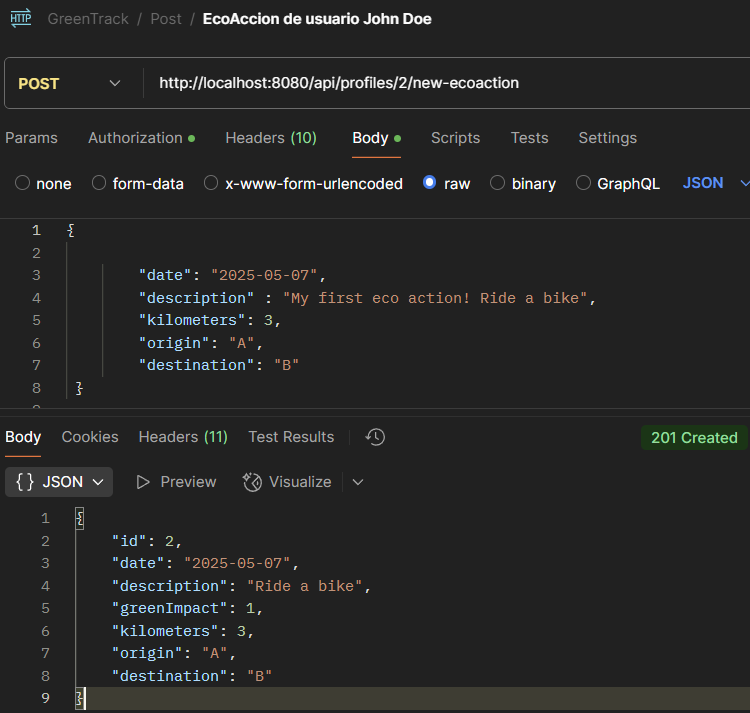

# greenTrack
### Green Track Project

Repositorio
https://github.com/peterParker79/greenTrack

Gestión de tareas con Trello
https://trello.com/b/R9eF2fVX/greentrack

Swagger:
http://localhost:8080/swagger-ui/index.html#

# “GreenTrack” — Hábitos Ecológicos
Una aplicación backend para registrar y seguir hábitos sostenibles de personas que desean reducir su huella ecológica.  
Usuarios que registran actividades como ir en bicicleta, reducir plásticos, plantar árboles, reciclar, etc.

Concepto
Los usuarios pueden registrar acciones ecológicas y ver su impacto verde estimado  basándonos en una puntuación numérica básica.
Los administradores podrán dar de alta o eliminar nuevas acciones.

### Para registrar un usuario: 

Registro de usuario: Es de acceso libre realizar el registro de un usuario. 

http://localhost:8080/api/public/register 
En el body de la petición se requiere nombre de *usuario* y *password*: 
{

        "name": "El nuevo",
        "password": "1234",
        "role": "ROLE_USER"
        
    }
Se obtiene un mensaje con los detalles del usuario registrado donde aparecen: 
-   id,
- nombre, 
- contraseña cifrada, 
- rol obtenido,
- las eco-acciones inicialmente vacías.

Ejemplo: 
Welcome El nuevo!! 
Has been registered User(id=19, name=El nuevo, password=$2a$10$066bz25qCAgSvYc9fxyeiOosz8bS5lf1YodaKIM4Md5lYPoNHieEm,  role=ROLE_USER, ecoActions=null)

### Para registrar un usuario con privilegios Administrador: 
Sólo un usuario Administrador puede crear usuarios con privilegios Administrador. 
El registro se ha de realizar a través de: 
http://localhost:8080/api/profiles/create-user 
(Ruta accesible sólo con  bearer token  Admin.) 

En el body de esta petición POST introducimos los datos del usuario Administrador a crear. 
{

        "name": "Nuevo administrador",
        "password": "1234",
        "role": "ROLE_ADMIN"
        
    }

Debemos tener la Authorización en Bearer Token y haber proporcionado un token válido

### Inicio de sesión y obtención de token: 
Una vez un usuario se ha registrado  puede ingresar en el sistema proporcionando  
el nombre de usuario y la contraseña empleada durante el proceso de registro en la siguiente ruta: 

http://localhost:8080/api/auth/login
 
En el body debemos introducir el usario y contraseña empleados en el registro 
{  
"name": "John Doe", 
"password": "1234" 
} 

Aparece el resultado del proceso de acceso. 
Se visualiza el token generado, el nombre de usuario y el rol obtenido.

{

token: aqui se muestra una cadena de texto que es el token,  
username: John Doe, 
role: ROLE_USER

} 
 Este proceso de registro sólo permite registrar usuarios
con privilegios de usuario y no de administrador.

### Acceso al perfil de usuario
Cada usuario con privilegios de usuario, sólo puede acceder a su perfil 
Acceso a perfil de usuario: 
http://localhost:8080/api/profiles/id_usuario

### Mostrar todos los usuarios registrados
Sólo usuarios Administradores. 
Es necesario aportar un bearer token válido de usuario administrador.
http://localhost:8080/api/profiles

### Dar de alta una nueva Eco Acción
Sólo usuarios Administradores. 
Los administradores crearán las Acciones Ecológicas disponibles. 
Los usuarios registrados en la APP podrán indicar que han realizado alguna de las eco acciones. 

http://localhost:8080/api/eco-action/create/to-cycle
 Body de esta petición POST que contiene la descripción de la eco acción montar en bicicleta 

        
    