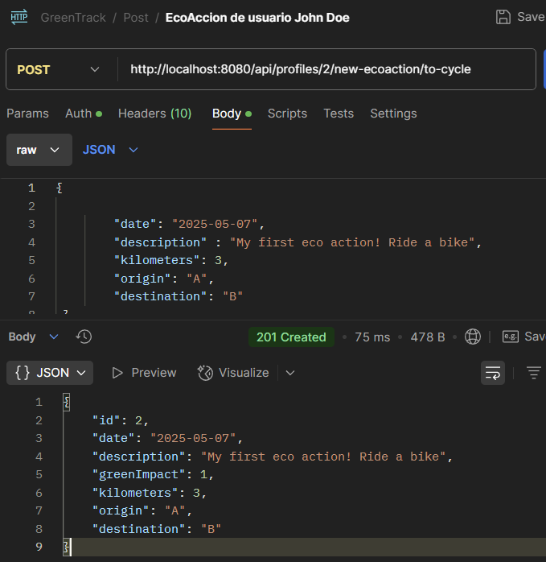

# 🌱 GreenTrack


**GreenTrack** es una aplicación backend desarrollada con **Java 21**, **Spring Boot** y **Spring Security**, diseñada para promover hábitos sostenibles y hacer seguimiento de acciones ecológicas individuales, midiendo el impacto positivo mediante una métrica llamada **GreenImpact**.

---

## 📎 Recursos del Proyecto

- 🔗 Repositorio: [GitHub - greenTrack](https://github.com/peterParker79/greenTrack)
- 🎞️ Presentación: [Google Slides](https://docs.google.com/presentation/d/e/2PACX-1vTTOlc0ChFb37zMRA5d2IKInCyXMlOZHsgtCLUjMXOfiO0tNxKbsuPadvBgzkQ8TaCWzH41ctWOcFqE/pub?start=false&loop=false&delayms=3000)
- ✅ Gestión de tareas: [Trello - GreenTrack](https://trello.com/b/R9eF2fVX/greentrack)


---

## 🌍 Descripción General

GreenTrack permite a los usuarios registrar actividades sostenibles como:

- Ir en bicicleta
- Reciclar
- Plantar árboles
- Limpiar playas

Cada acción se traduce en un impacto positivo **GreenImpact**.

---
## 👋 Bienvenida 

- Endpoint: `GET /api/public`
Green Track en su endpoint de inicio nos da la bienvenida .
Muestra los usuarios actuales registrador.
Nos anima a registrarnos.

 Resultado:

--- 
## 👤 Gestión de Usuarios

### 🔓 Registro de Usuario

- Endpoint: `POST /api/public/register`
- Acceso: Público

Se debe proporcionar un nombre de usuario y contraseña.

**Ejemplo de Body JSON:**
```json
{
    "name": "Alicia Gonzalez",
    "password": "1234"
}
```

 Respuesta:


---

### 🔐 Registro de Administrador

Solo disponible para usuarios con rol `ROLE_ADMIN` mediante **Bearer Token**.
En el body de la petición se ha de indicar el role ROLE_ADMIN.

- Endpoint: `POST /api/profiles/create-user`

**Ejemplo de Body JSON:**
```json
{
    "name": "otro administrador",
    "password": "1234",
    "role": "ROLE_ADMIN"
}
```

 Resultado:


---

### 🔑 Inicio de Sesión

- Endpoint: `POST /api/auth/login`

**Ejemplo de Body JSON:**
```json
{
    "name": "John Doe",
    "password": "1234"
}
```

📸 Resultado:


---

## 👤 Acciones de Usuario

### 👁️ Ver Perfil Personal

- Endpoint: `GET /api/profiles/{id_usuario}`
- Acceso restringido al usuario dueño del perfil.


📸 Resultado:


---

### 👥 Ver Todos los Usuarios (Admin)

- Endpoint: `GET /api/profiles`
- Requiere Token de Administrador

📸 Resultado:


---

## 🌿 EcoAcciones

### ➕ Crear Nueva EcoAcción (Admin)

- Endpoint: `POST /api/eco-action/create/to-cycle`

📸 Resultado:


---

### 🚴 Registrar Acción Ecológica como Usuario

- Endpoint: `POST /api/profiles/{id_perfil}/new-ecoaction/to-cycle`

**Datos requeridos:**
- Descripción
- Kilómetros recorridos
- Origen y destino

📸 Ejemplo:


---

## 🏁 Endpoints Clave

| Acción | Método | Ruta |
|-------|--------|------|
| Bienvenida | `GET` | `/api/public` |
| Registro usuario | `POST` | `/api/public/register` |
| Login | `POST` | `/api/auth/login` |
| Crear usuario admin | `POST` | `/api/profiles/create-user` |
| Ver perfil | `GET` | `/api/profiles/{id}` |
| Ver todos los usuarios | `GET` | `/api/profiles` |
| Crear ecoAcción | `POST` | `/api/eco-action/create/{tipo}` |
| Registrar ecoAcción usuario | `POST` | `/api/profiles/{id}/new-ecoaction/{tipo}` |

---
## Obtener Documentación del proyecto.
Gracias a Swagger puedes obtener información del proyecto, probar y visualizar
los enpoints de una manera rápida. **Deberás clonar el proyecto y ejecutarlo
de manera local**. A través del enlace de abajo puedes acceder a Swagger.<br>
- 📘 Swagger UI: [Documentación Swagger (local)](http://localhost:8080/swagger-ui/index.html#)

## 📐 Diseño del Sistema

### 🧩 Diagrama de Clases


---

### 🗄️ Esquema Base de Datos


---


---

## 💚 Gracias por tu GreenImpact
¡Gracias por utilizar GreenTrack y contribuir a un mundo más sostenible! 🌍✨

